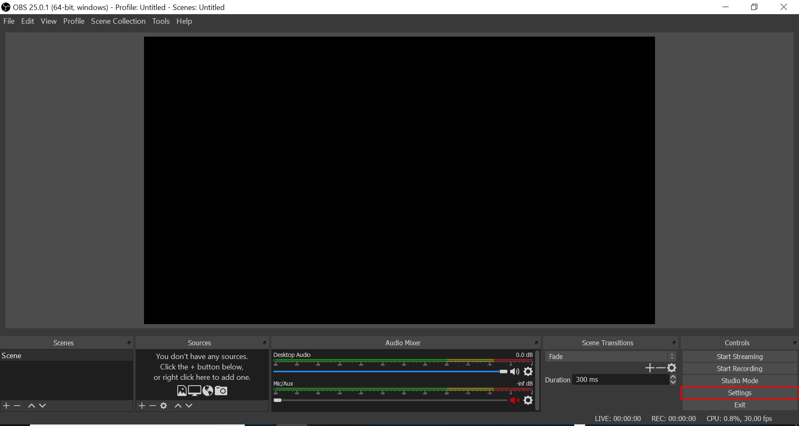
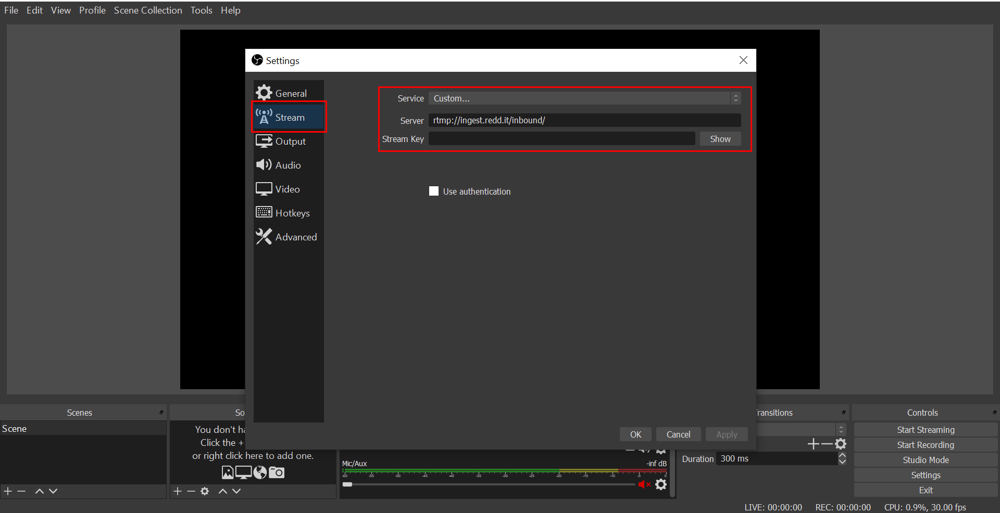
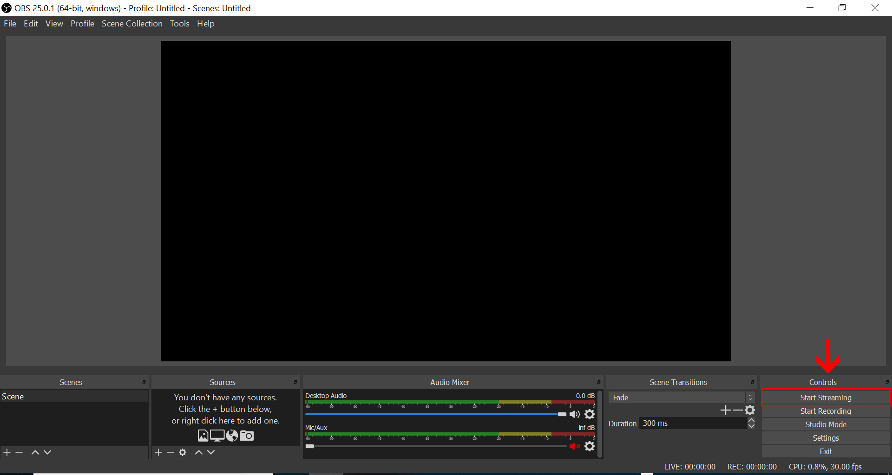

# SnooKey
Some reddit users figured out a way to stream to RPAN (Reddit's livestreaming platform) from desktop streaming software 
(like OBS).  Project SnooKey is my attempt at making this possibilty more accessible to RPAN users.

**u/IOnlyPlayAsDrif made an updated version to improve the user experience: [Snookey2](https://github.com/IOnlyPlayAsDrift/Snookey2)**  
**u/premek_v made a bash based version for Linux systems! [SnooKey (Bash)](https://github.com/premek/rpan)**

## START HERE
### Method 1 (Windows only)
If you have a windows machine, you can run SnooKey without installing python by simply cloning the repository
(see 'Installation' section) and running ```snookey.exe```

### Method 2 (All platforms)
For this to work you will need Python3 installed to your system.      
*IF YOUR TERMINAL THINKS 'PYTHON' IS NOT A COMMAND, PYTHON HAS MOST LIKELY NOT BEEN ADDED TO YOUR PATH*     
[Install Python for Windows](https://realpython.com/installing-python/#windows)   
[Install Python for Linux](https://realpython.com/installing-python/#linux)   
[Install Python for OS X](https://realpython.com/installing-python/#macos-mac-os-x)   
Make sure the python requests module is installed for the script to work:
```
pip install requests
```
OR
```
pip3 install requests
```

## Installation
Download the zip file by pressing the green 'Clone or download' button and selecting 'Download ZIP'   
**OR**    
Clone the repository with:
```
git clone https://github.com/Spikeedoo/SnooKey.git
```
Navigate to the repository:
```
cd SnooKey
```

## Using SnooKey
Once you have SnooKey downloaded, it is time to run the script.     
(**If you used method #1 simply run ```snookey.exe```**)
```
python snookey.py
```
OR
```
python3 snookey.py
```
This will open a link in your browser allowing you to get an access code from Reddit    
**NOTE:** The Reddit app you are allowing access is not mine.  It is the client_id for the mobile, in this case android, Reddit app.    
One way you can confirm that I am not BS'ing you is by looking at [your apps](https://www.reddit.com/prefs/apps/) after allowing access.
A third party application would normally appear here in the 'authorized applications' section with the developer's username.  This Reddit-built
application does not follow the same rules.

Thanks to Zipdox's contribution, the access token is automatically passed to the terminal and you can close your browser.   

Follow the next two prompts by passing the subreddit you want to broadcast to and your stream's title:
```
Subreddit you want to broadcast to: <i.e. distantsocializing>
Stream title: <i.e. RPAN and chill!>
```
If all goes well you will be given your streamer key and the rpan link people will visit your stream from.

## How to use your streamer key
Step 1: Open up your desktop streaming software (in my example, OBS)    
    
Step 2: Navigate to your stream settings (Settings > Stream in OBS)   
    
Step 3: Make sure your Service is set to 'Custom' and fill in the following settings:
- Server: rtmp://ingest.redd.it/inbound/
- Stream Key: (your stream key)

    
Now hit 'Apply' and 'OK'

Hit 'Start Streaming' and watch the magic happen!

Right now we believe 1080x1920 downscaled to 720x1280 is the way to go.

Disclaimer: I am not liable for your stupidity.  Please be responsible and follow the [Rules](https://www.redditinc.com/policies/broadcasting-content-policy).  Cheers.  
